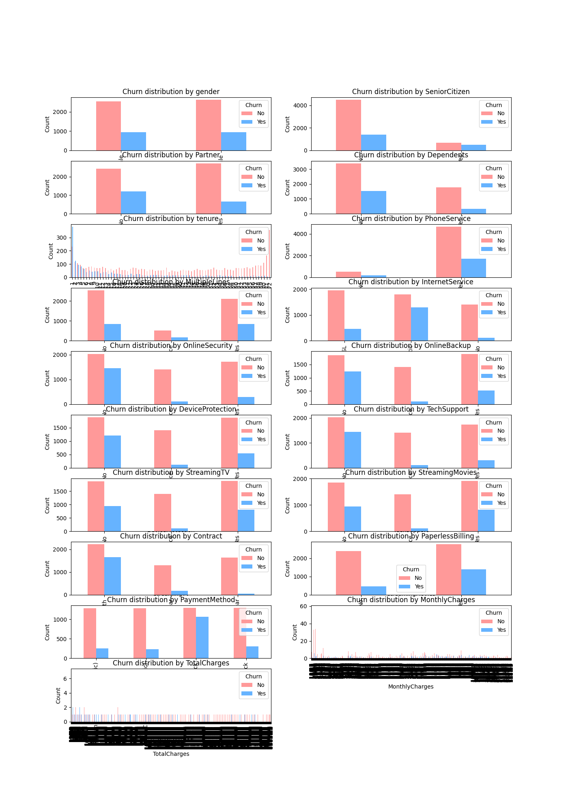
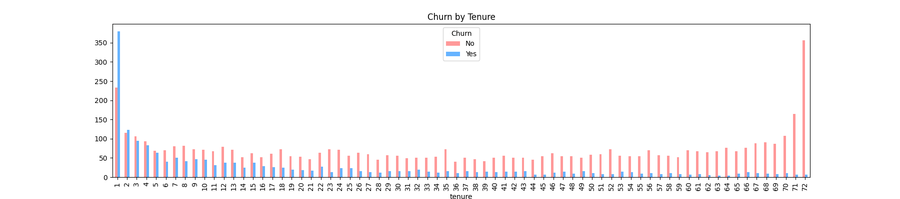
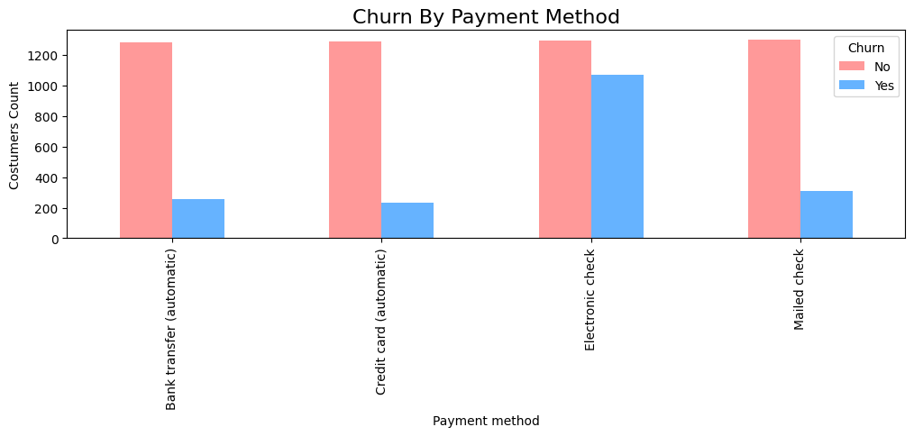
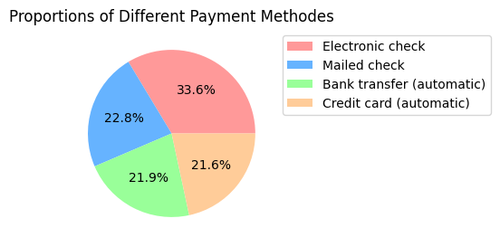
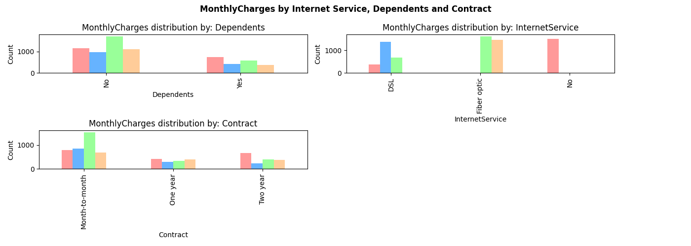

# Customer Churn Analysis and Prediction

A Python-based pipeline for exploring customer demographics and predicting churn using optimized K-Nearest Neighbors (KNN). This project automates data cleaning, generates comprehensive visualizations, and tunes a classification model to identify key churn drivers.
This was a school project, there are still a lot of things to adjust.

## Table of Contents
- [Overview](#overview)
- [Workflow](#workflow)
- [Key Visualizations](#key-visualizations)
- [Modeling & Performance](#modeling--performance)
- [Installation](#installation)
- [Usage](#usage)

---

## Overview
The project is divided into two main stages:
1.  **Exploration & Visualization:** Automated generation of statistical plots to understand feature distributions and their relationship with customer churn.
2.  **Predictive Modeling:** A machine learning pipeline that handles data preprocessing, hyperparameter tuning via GridSearchCV, and model evaluation. 

## Customer Survival Analysis:
- The objectif of this analysis is to answer the following questions:<br>
* How we can model the relationship between customer churn, time, and other customer characteristics?
* What are the significant factors that drive customer churn?
* What is the survival and Hazard curve of a specific customer?<br>
### Data Visualizations:
- I ploted all the features against the target to detect the relationship and dependencies between them.<br>

<br>
From above graphs we can conclude following:
1. Both genders have the same churning rate
2. Not senior citizens tend to keep their 
3. People who have dependents (for example, children, a spouse, elderly parents, or others who rely on the customer for financial support) churn less that the ones who don't.
4. People who have phone services churn way more
5. Month-to-month contracts have a dramatically higher churn rate than other contract types
6. Customers with Fiber optic service show a significantly higher churn rate compared to those with DSL
7. Customers paying by Electronic check are more sustainable
8. The higher the monthly charges the higher the churn rate
9. it is observed that Customers who came with partners are very less likely to churn
<br>
- I plotted specific features that showed a high coordination with my target information:

<br>


<br>

<br>

<br>
- Conclusions:
*   **Internet Service is the #1 Price Driver:**
    *   Fiber Optic = Highest Bills
    *   DSL = Medium Bills
    *   No Internet = Lowest Bills

*   **Contract Length Signals Customer Type:**
    *   Month-to-Month = Higher paying, but high-risk (likely to leave).
    *   Two-Year Contracts = Lower paying, but most loyal and stable.

*   **Dependents Have a Minor Impact:**
    *   Customers with no dependents tend to spend slightly more.

*   **Key Customer Profiles**:

    *   Clients with Month-to-month contacts who are also more likely paying for premium services like Fibre Optic with Electronic Checks
    * Loyal Customers are the ones using long term contracts, automatic payment methodes(Bank or credit card Automatic Transfer and Mailed Check)
    $\rightarrow$ It seems like we have to migrate hight-risk (short term and highly paying contracts) to low-risk loyal customers activities.


## Installation
```bash
# Clone the repository
git clone https://github.com/yourusername/Churn-Analysis.git

# Install dependencies
pip install pandas numpy matplotlib seaborn scikit-learn eli5
```

## Usage
Ensure your dataset is placed in `../data/customer_data.csv`.

### 1. Run Exploration
Generate all visual assets:
```bash
python exploration.py
```

### 2. Run Modeling
Train the model and output performance metrics:
```bash
python model.py
```
